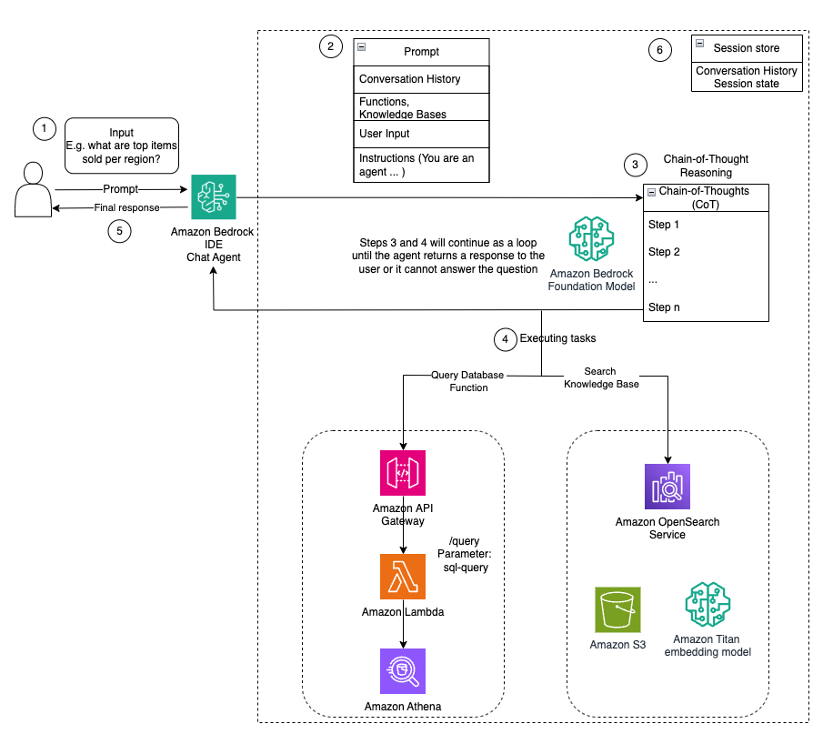

# Natural Language Query Engine with Amazon Bedrock Studio

This repository provides supplemental artifacts for our blog post "Building a Natural Language Query Engine with Amazon Bedrock Studio." It includes structured sales data, unstructured product data and customer reviews, OpenAPI schemas, CloudFormation templates, and LLM prompts.

## Description

In our blog post, we explore how Bedrock Studio simplifies the process of building generative AI applications. We guide you through:
- Setting up your development environment
- Leveraging pre-built models and templates
- Integrating APIs and knowledge bases
- Deploying your application

The use case demonstrates:
- Creating a text-to-SQL engine for natural language queries
- Processing structured data for insights
- Integrating unstructured data sources
- Combining results for comprehensive analysis

## Dataset

- Main dataset: [Sample CSV Files / Data Sets for Testing](https://excelbianalytics.com/wp/downloads-18-sample-csv-files-data-sets-for-testing-sales/) (Sales Datasets up to 5 Million Records)
- Additional data: Synthetic product data and customer reviews
- Automatic dataset deployment via CloudFormation template

## Architecture



### Provisioned Resources

The CloudFormation template creates:
- AWS Lambda functions for Athena query execution
- IAM roles for Lambda-Athena access
- API Gateway REST API with POST method
- S3 bucket for data storage
- AWS Glue Database and Tables for Sales dataset

## User Interaction Flow

Agents for Amazon Bedrock enable builders to execute multistep tasks in generative AI applications. In this architecture, Agents for Amazon Bedrock initiate the process by sequentially reasoning through the user's query. They break down the query into smaller components and understand the context behind each component. Through contextual understanding, the agents maintain a coherent Chain-of-Thought (CoT), ensuring that each part of the query contributes logically to the overall intent. The following steps show how Bedrock Agents use chaining of thoughts to execute the task of converting natural language to SQL queries:
### 1.	Prompt 
- The user initiates the process by providing a natural language prompt, such as "What were the key insights from the positive and negative product reviews for our high-revenue cosmetics line in Asia?" 
- The prompt is sent to Amazon Bedrock Studio, which serves as the interface for interacting with the generative AI application.
### 2.	Agents for Amazon Bedrock: 
Bedrock Studio forwards the input to an Amazon Bedrock Agent. The agent uses prompts, conversation history, action groups, knowledge bases, and specific instructions to interpret and process the input.
### 3.	Chain-of-Thought (CoT) Reasoning
- The agents use Chain-of-Thought reasoning to break down a complex user query inter simpler, logical parts.
- The agents then determine a course of action for how they will find the necessary information to respond to the user query (ex. Search the knowledge base or query the database).
### 4.	Task Execution
- The agent executes the necessary tasks based on the broken-down query components:
- Structured Data Query:
    - The agent accesses the data schema instructions to understand the structure of the sales data store
    - It then queries the database by interacting with Amazon API Gateway.
    - Amazon API Gateway forwards the requests to a the Lambda function to processe the SQL queries using Amazon Athena.
- Unstructured Data Query:
    - The agent searches the knowledge base for relevant information.
    - The knowledge base, containing sales related insights, uses Amazon Titan embedding model for data indexing and retrieval.
    - Amazon OpenSearch Service facilitates searching through the knowledge base. 
### 5.	Response
- The agent compiles the results from both structured and unstructured data sources.
- The processed and formatted response is sent back to the user through Bedrock Studio.
### 6.	Session Store: 
Throughout the process, Bedrock Studio maintains the conversation history and session state to handle follow-up questions and maintain context.


## Requirements

- AWS CLI (v2.x)
- AWS SDK (v3.x)
- Python 3.8+
- AWS account with appropriate permissions

## Deployment

### Console Deployment

1. Download the GitHub repository (includes OpenAPI schemas, text files, and example pages)

2. (Conditional) Deploy API Gateway Logging Stack
   - Required if you don't have an API Gateway CloudWatch logging role
   - Click "Launch Stack" in console
   - Name the stack (e.g., "api-gateway-logging-stack")
   - Review and acknowledge IAM resource creation
   - Create stack and note the APIGatewayCloudWatchRoleArn output

3. Deploy Main Stack
   - Click "Launch Stack" in console
   - Select desired AWS region
   - Review stack details
   - Acknowledge IAM resource creation
   - Create stack
   - Note the outputs:
     - SalesDataS3Bucket
     - TextToSqlEngineAPIGatewayURL
     - TextToSqlEngineAPIGatewayApiKey

### CLI Deployment

Note: Commands are for Linux-based systems. Windows users may need to adjust syntax.

1. Clone the repository:
```bash
git clone https://github.com/ameerhakme/amazon-bedrock-studio-demo.git
cd bedrock-studio-text-to-sql-engine
```

2. (Conditional) Deploy API Gateway Logging Stack:
```bash
aws cloudformation create-stack \
    --stack-name api-gateway-logging-stack \
    --template-body file://cloudformation/cloudformation_deployAPIGW_logging_IAM_Role \
    --capabilities CAPABILITY_NAMED_IAM
```

3. Deploy main stack:
```bash
aws cloudformation create-stack \
    --stack-name text-to-sql-engine \
    --template-body file://cloudformation_with_SampleData.yaml \
    --capabilities CAPABILITY_NAMED_IAM
```

4. Monitor deployment:
```bash
aws cloudformation describe-stacks \
    --stack-name text-to-sql-engine \
    --query 'Stacks[0].StackStatus'
```

5. Get deployment information:
```bash
# API Gateway URL
aws cloudformation describe-stacks \
    --stack-name text-to-sql-engine \
    --query 'Stacks[0].Outputs[?OutputKey==`TextToSqlEngineAPIGatewayURL`].OutputValue' \
    --output text

# API Key ID
aws cloudformation describe-stacks \
    --stack-name text-to-sql-engine \
    --query 'Stacks[0].Outputs[?OutputKey==`TextToSqlEngineAPIGatewayApiKey`].OutputValue' \
    --output text

# API Key Value
aws apigateway get-api-key \
    --api-key <TextToSqlEngineAPIGatewayApiKey> \
    --include-value \
    --query 'value' \
    --output text
```

## Usage

### Query Athena
```bash
curl -X POST <TextToSqlEngineAPIGatewayURL>/query \
    -H "x-api-key: <APIKeyValue>" \
    -H "Content-Type: application/json" \
    -d '{
        "query": "SELECT * FROM title_ratings Limit 10",
        "database": "imdb"
    }'
```